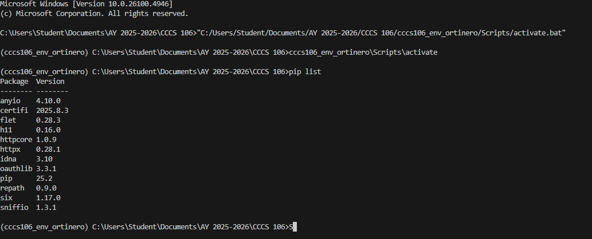
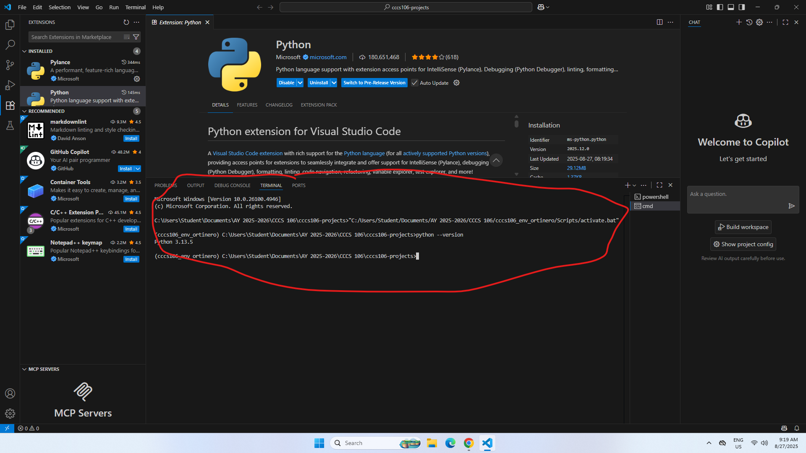
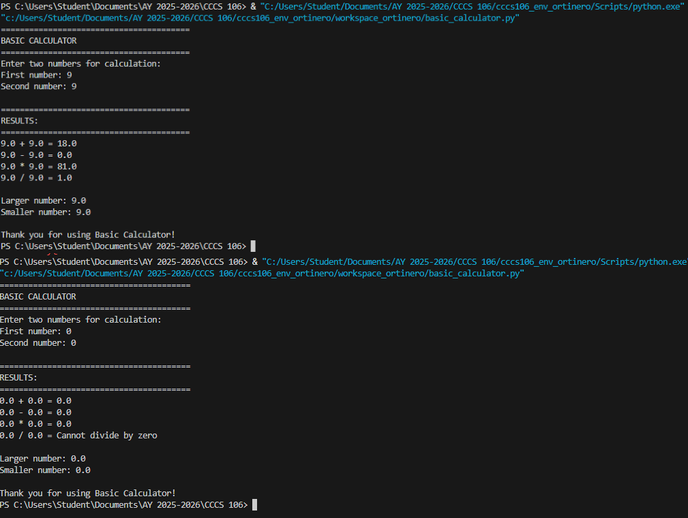
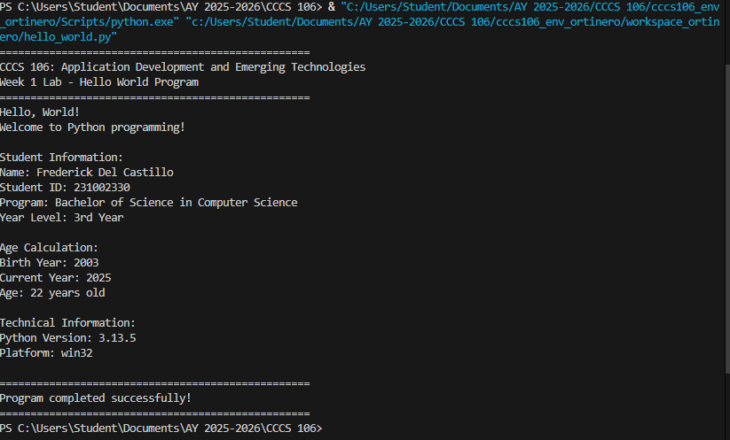

# Lab 1 Report: Environment Setup and Python Basics  

**Student Name:** Ortinero, Frederick D. 
**Student ID:** 231002330   
**Section:** BSCS - 3A 
**Date:** 08-27-2025 

## Environment Setup  

### Python Installation  
- **Python Version:** 3.11.5  
- **Installation Issues:** at first i got confuse with path cuz cmd didnt detect python, fix it by restart cmd and then it worked.  
- **Virtual Environment Created:** ✅ cccs106_env_lastname  

### VS Code Configuration  
- **VS Code Version:** 1.82.0  
- **Python Extension:** ✅ Installed and configured  
- **Interpreter:** ✅ set to my cccs106_env_lastname/Scripts/python.exe  

### Package Installation  
- **Flet Version:** 0.28.3  
- **Other Packages:** none right now  

## Programs Created  

### 1. hello_world.py  
- **Status:** ✅ Completed  
- **Features:** print hello world, show my info, calculate age, also display python version  
- **Notes:** i messed first with f string format but fix it by checking example  

### 2. basic_calculator.py  
- **Status:** ✅ Completed  
- **Features:** add, minus, multiply, divide, error handling for zero and wrong input, also bigger/smaller number  
- **Notes:** division part give me small problem but i just use if condition  

## Challenges and Solutions  
some challenge was setting up path cuz cmd not detect python at first. also i forgot to activate env before running program, so package not found. solve it by re-activating environment.  

## Learning Outcomes  
i learned how to install python properly, use venv, and run code inside vs code. i understand now why virtual env is important. also practice simple python syntax and basic calculator program.  

## Screenshots  
-   
-  
-   
- 