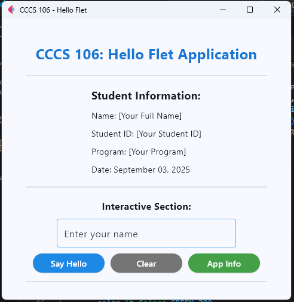
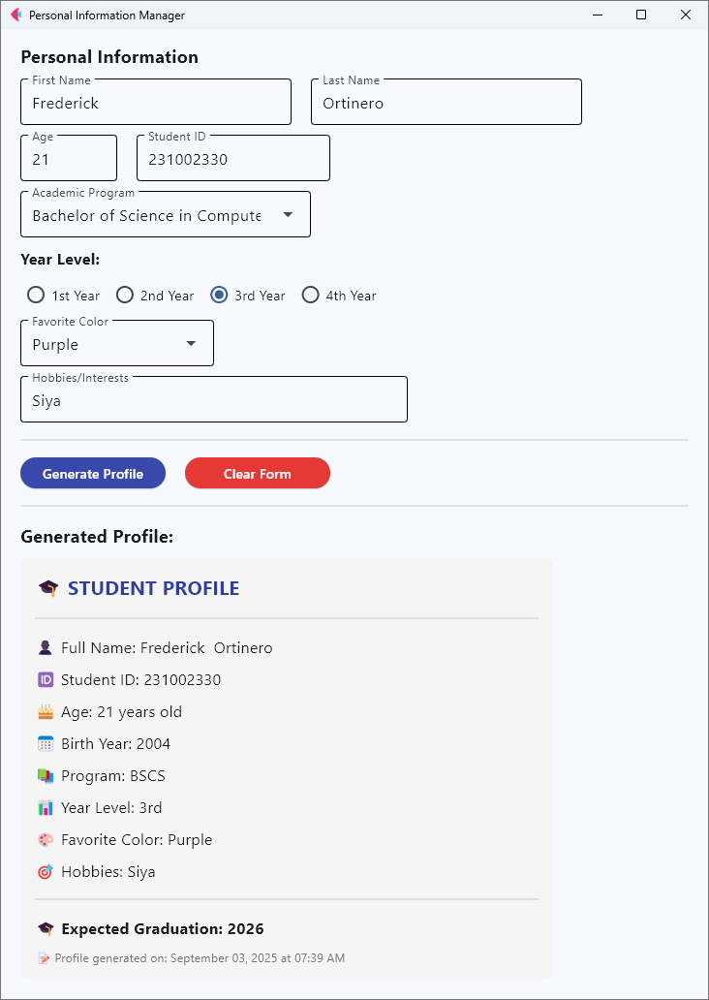

# Lab 2 Report: Git Version Control and Flet GUI Development  

**Student Name:** Frederick D. Ortinero
**Student ID:** 231002330
**Section:** BSCS 3A
**Date:** September 3, 2025  

---

## Git Configuration  
### Repository Setup  
- **GitHub Repository:** https://github.com/Fred727wysi/cccs106-projects  
- **Local Repository:** ✅ Initialized and connected  
- **Commit History:** 1 commit  
  - 8417cc0 Initial commit with week1 and week2 labs

### Git Skills Demonstrated  
- ✅ Repository initialization and config  
- ✅ Adding, committing, pushing changes  
- ✅ Branch creation + merging  
- ✅ Remote repository management  

---

## Flet GUI Applications  

### 1. hello_flet.py  
- **Status:** ✅ Done  
- **Features:** greeting based on name, show student info, dialog box with app info  
- **UI Components:** Text, TextField, Buttons, Dialog, Containers  
- **Notes:** kinda struggled at first with event handlers but fixed it by checking docs and simple examples  

### 2. personal_info_gui.py  
- **Status:** ✅ Done  
- **Features:** complete form inputs, dropdowns for course, radio button for year, profile generation with birthyear + grad year  
- **UI Components:** TextField, Dropdown, RadioGroup, Containers, scrolling area  
- **Error Handling:** added input validation so it won’t crash when fields are empty  
- **Notes:** hardest part is making it look neat on layout, but scrolling container helped  

---

## Technical Skills Developed  

### Git Version Control  
- understand local + remote repo concept  
- basic workflow (add, commit, push) feels more natural now  
- learned how to make branch and merge without messing up too bad  
- remote sync with GitHub is kinda tricky at first but managed  

### Flet GUI Development  
- practiced syntax of Flet 0.28.3  
- page config and layout management, like spacing and alignment  
- handling events when clicking button, updating text dynamically  
- made simple UI but with interactive features  

---

## Challenges and Solutions  
When I was doing the lab step by step I messed up the directory structure. At first I put all the files inside week1_labs by mistake, so week2 files was also ending up there. I only realized later when checking the guide that it should be separated into week1_labs and week2_labs. I had to move the files around in VS Code and push again.  

Another problem was I got confused with git push because the remote repo already had something, so my first push was rejected. I solved it by learning to use `git pull --rebase` before pushing again.  

Even if the repo structure was not exactly same at first, the python programs like hello_flet.py and personal_info_gui.py was working fine when I run them, so the functionality was not affected, just the file organization.

---

## Learning Outcomes  
I learned how to properly organize repo structure with week1 and week2 labs. Also gained confidence with git commands coz before I just memorize but now I kinda understand why we do add, commit, push. With Flet, I got exposed to GUI programming, it’s diff from normal Python scripts, but fun to make things interactive.  

---

## Screenshots  

### Git Repository  
- [ ] GitHub repository with commit history  
- [ ] Local git log showing commits  

### GUI Applications  

**Hello Flet Output**  
  

**Personal Info GUI Output**  
  

---

## Future Enhancements  
- maybe add save profile to text file or json  
- enhanced calculator with more functions (like scientific ops)  
- nicer UI layout with colors and styling so not too plain  
